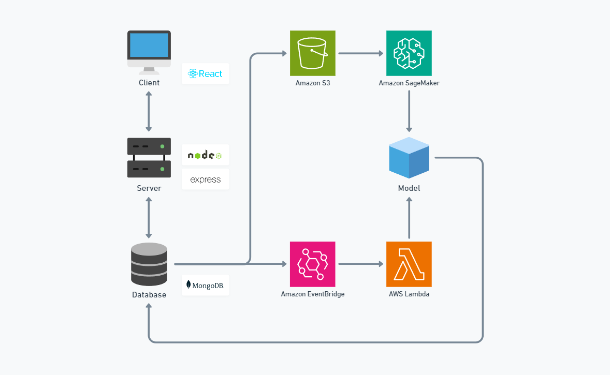

### 🎬 About The Project

This project involves the development of a personalized recommendation system for a movie streaming service.

Website: [https://kawastream.kawamottyan.com/](https://kawastream.kawamottyan.com/)  
Article: [日本語](https://zenn.dev/kawamottyan/articles/5d5700923796cd)

This project inspired by  
- [Netflix Technology Blog](https://netflixtechblog.medium.com/)
- [hungpthanh's GitHub Project](https://github.com/hungpthanh/GRU4REC-pytorch)
- [trananhtuat's GitHub Project](https://github.com/trananhtuat/fullstack-mern-movie-2022)
- [@DataScienceGarage's Youtube Tutorial](https://www.youtube.com/watch?v=stD47vPDadI)

### 👏 Getting Started

1. Setup

    clone my repo
    ```
    git clone https://github.com/kawamottyan/kawastream.git
    ```

    change directory
    ```
    cd kawastream
    ```

2. Data Preparation

    set up data from MovieLens
    - run dataprocessing.ipynb
    - run datasplitting.ipynb

    save TMDB data in MongoDB
    - set up Lambda Environment
        ```
        ATLAS_URI	mongodb+srv://... # add your MongoDB Connection String here
        TMDB_KEY	eec... # add your TMDB API key here
        ```
    - set up Lambda [Function](https://github.com/kawamottyan/kawastream/tree/main/model/aws/Lambda/FUNCTION/TMDB/lambda_function.py)

3. Server Deployment

    create env file in the server folder
    ```
    MONGODB_URL=mongodb+srv://... # add your MongoDB Connection String here
    PORT=5000
    TOKEN_SECRET=... # create your secret key here
    TMDB_BASE_URL=https://api.themoviedb.org/3/
    TMDB_KEY=eec... # add your TMDB API key here
    ```

    run server
    ```
    cd server
    yarn install
    yarn start
    ```

4. Client Deployment

    run client
    ```
    cd client
    yarn install
    yarn start
    ```

5. Model Deployment

    set up aws
    - save data from datasplitting.ipynb in S3
    - set up [SageMaker](https://github.com/kawamottyan/kawastream/tree/main/model/aws/SageMaker)
    - set up [Lambda](https://github.com/kawamottyan/kawastream/tree/main/model/aws/Lambda)

### 🖌️ System Architecture



### 🗂️ Structure

```
├─ client
│   ├─ public
│   └─ src
│       ├─ api
│       │   ├─ client
│       │   ├─ configs
│       │   └─ modules
│       ├─ components
│       ├─ configs
│       ├─ hooks
│       ├─ pages
│       ├─ redux
│       ├─ routes
│       ├─ util
│       ├─ App.jsx
│       └─ index.jsx
├─ model
│   ├─ aws
│   │   ├─ Lambda
│   │   └─ SageMaker
│   │       ├─ GRU4Rec
│   │       └─ LinUCB
│   ├─ eval
│   │   └─ model_eval.ipynb
│   ├─ experiment
│   │   ├─ EDA
│   │   └─ model
│   │       ├─ benchmark
│   │       ├─ reinforcement_learning
│   │       └─ rnn
│   ├─ dataprocessing.ipynb
│   └─ datasplitting.ipynb
├─ server
│   ├─ src
│   │   ├─ axios
│   │   ├─ controllers
│   │   ├─ handlers
│   │   ├─ middlewares
│   │   ├─ models
│   │   ├─ routes
│   │   └─ tmdb
│   ├─ .env.example
│   └─ index.js
├─ LICENSE
└─ README.md
```

### 🚗 Roadmap

- [ ] Verification in an Online Environment


### 📌 License

Apache-2.0 license

### 👤 Contact

Name: Masato Kawamoto  
Email: kawamoto@kawamottyan.com
